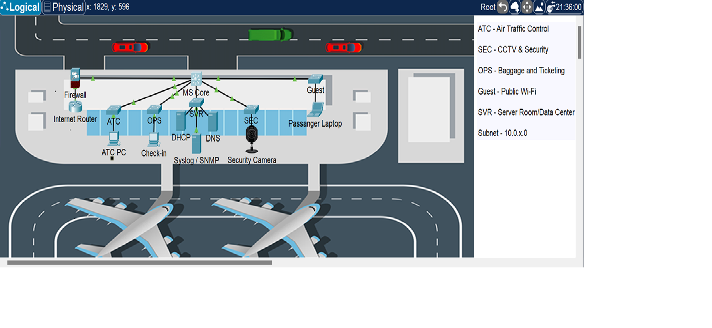

# ✈️ Ghost Net Lab: Project IMIA
### Next-Gen Secure Airport Infrastructure
**Lead Engineer:** Isiphile Maqhashu  
**Status:** stable | Zero-Trust Enforced

---

## Executive Summary
Project **IMIA** (Isiphile Maqhashu International Airport) is a high-availability network architecture designed to handle the complex traffic requirements of a modern aviation hub. This project serves as a capstone implementation of a **Zero-Trust** security philosophy, ensuring that critical airport systems—such as **Air Traffic Control (ATC)**—are logically and physically isolated from public-facing services.

## Architecture & Topology
The infrastructure utilizes a three-tier hierarchical model, centering on the **GhostCore01** Multilayer Switch and the **Cisco ASA 5505 Firewall**.

**

### Segmentation (VLAN Logic)
| ID | Zone | Subnet | Description |
| :--- | :--- | :--- | :--- |
| **10** | **ATC** | 10.0.10.0/24 | Critical Flight Operations (Restricted) |
| **20** | **Security** | 10.0.20.0/24 | CCTV & Access Control Systems |
| **30** | **Operations** | 10.0.30.0/24 | Staff & Ground Logistics |
| **40** | **Guest** | 10.0.40.0/24 | Public Terminal Wi-Fi (Isolated) |
| **50** | **Servers** | 10.0.50.0/24 | Centralized DHCP & Web Services |

---

## Security Implementation
This lab demonstrates advanced security protocols acquired through 3 years of specialized training:

* **Stateful Perimeter Defense:** Implementation of a Cisco ASA 5505 to perform deep packet inspection (SPI) and object-based NAT, cloaking the internal `10.x.x.x` schema.
* **Inter-VLAN Routing & Relay:** Configuration of `ip helper-address` on the Core Switch to bridge isolated broadcast domains to the centralized DHCP server.
* **Zero-Trust Boundaries:** Use of standard and extended ACLs to prevent lateral movement from the **Guest** zone into the **ATC** or **Security** zones.
* **Layer 2 Hardening:** Mitigation of MAC-based attacks via Port Security and unauthorized access control.

## Access & Audit
To review the configurations or test the live environment in Cisco Packet Tracer:

- **Topology File:** `topology/IMIA_Airport_Final.pkt`
- **Credentials:** Consult the `docs/LAB_ACCESS.md` file (Zero-password policy applied for audit efficiency).

---

## Project Achievements
- [x] Successfully mitigated **Asymmetric Routing** via static return paths on the ASA.
- [x] Verified full **DHCP propagation** across all 5 VLANs via L3 Relay.
- [x] Implemented **Full-Connectivity** to the ISP while maintaining 100% internal masking.

---
*Created by Isiphile Maqhashu - 2026 Ghost Net Lab Series*
